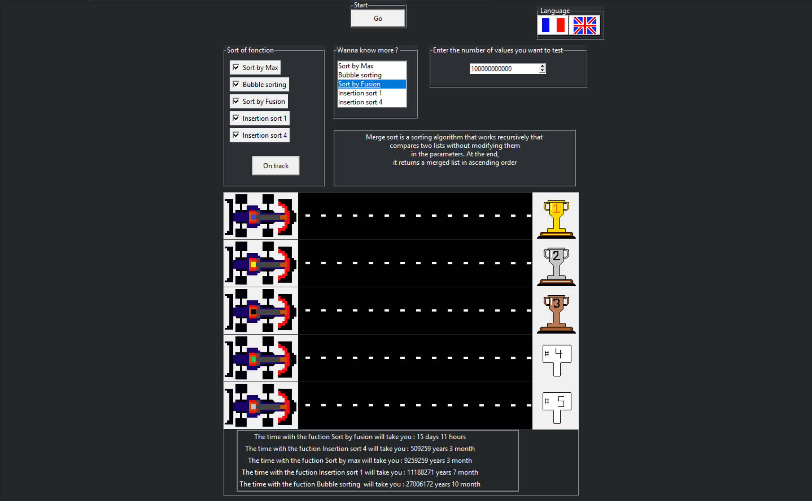

# Projet de Comparaison d'Algorithmes de Tri

Ce projet est une application développée en Python utilisant `tkinter` pour comparer les temps d'exécution de différents algorithmes de tri. Le but est de fournir une interface utilisateur permettant de lancer des tests et de visualiser les résultats.

## Algorithmes de Tri Comparés

Les algorithmes de tri suivants sont inclus dans ce projet :
- Tri par Max
- Tri à Bulle
- Tri par Insertion 1
- Tri par Insertion 4
- Tri par Fusion

## Fonctionnalités

- **Interface utilisateur** : L'interface est conçue avec `tkinter`, offrant une expérience interactive pour sélectionner et comparer les algorithmes.
- **Sélection de la langue** : Support pour le français et l'anglais.
- **Affichage des résultats** : Les résultats sont affichés de manière graphique, simulant une course de voitures pour chaque algorithme.

## Configuration et Exécution

### Prérequis

- Python 3.x
- `tkinter` (généralement inclus avec Python)

### Installation

1. Clonez le repository :
    ```sh
    git clone https://github.com/ewenman5137/Comparateur_Algorithmique
    cd votre-repository
    ```

2. Assurez-vous d'avoir les dépendances nécessaires :
    ```sh
    pip install -r requirements.txt
    ```

### Exécution

Lancez l'application en exécutant le fichier principal :
```sh
python main.py


